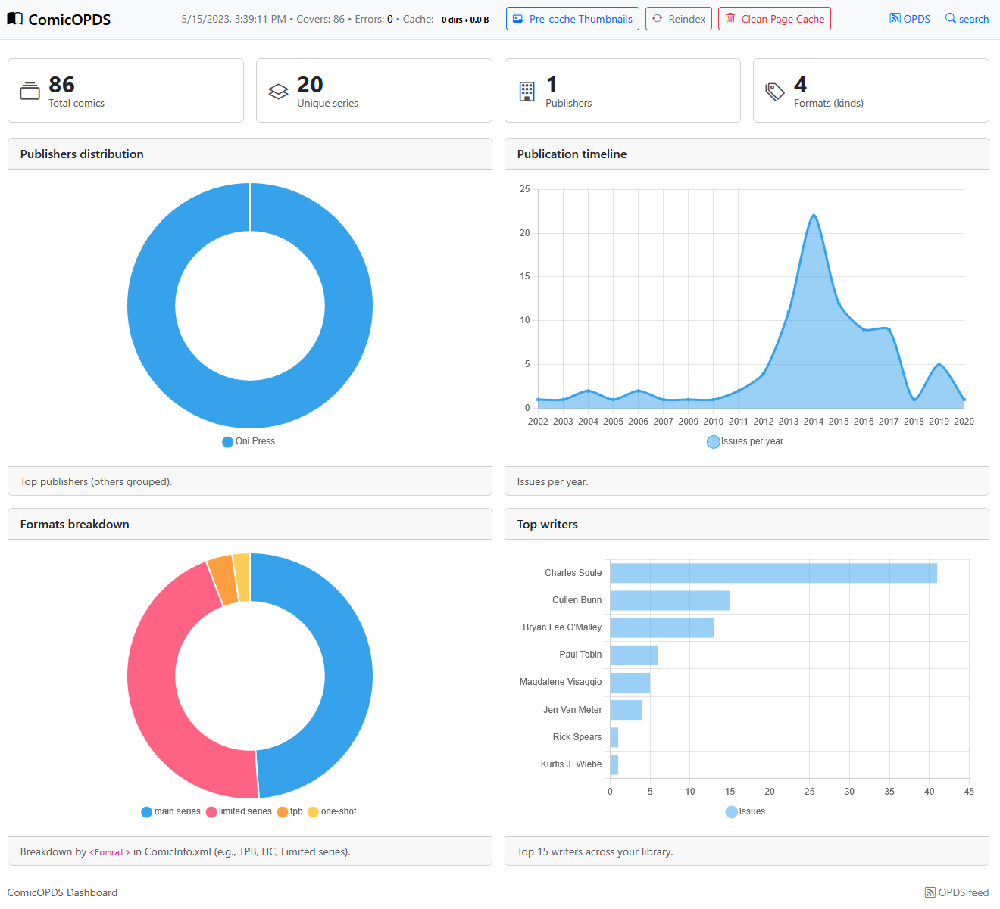

## 📊 Dashboard

> Access through `/dashboard`

The dashboard provides a comprehensive overview of your comic library:

### Features
- **Library Statistics**: Total comics, unique series, publishers
- **Interactive Charts**:
  - Publishers distribution (doughnut chart)
  - Publication timeline (line chart)  
  - Top writers (horizontal bar chart)
  - Format breakdown
- **Management Tools**:
  - Reindex library button
  - Pre-cache thumbnails button
  - Clean pages-cache button
  - Progress bars for ongoing operations
- **Error Monitoring**: 
  - Thumbnail extraction error counter
  - Downloadable error log

### Screenshot

