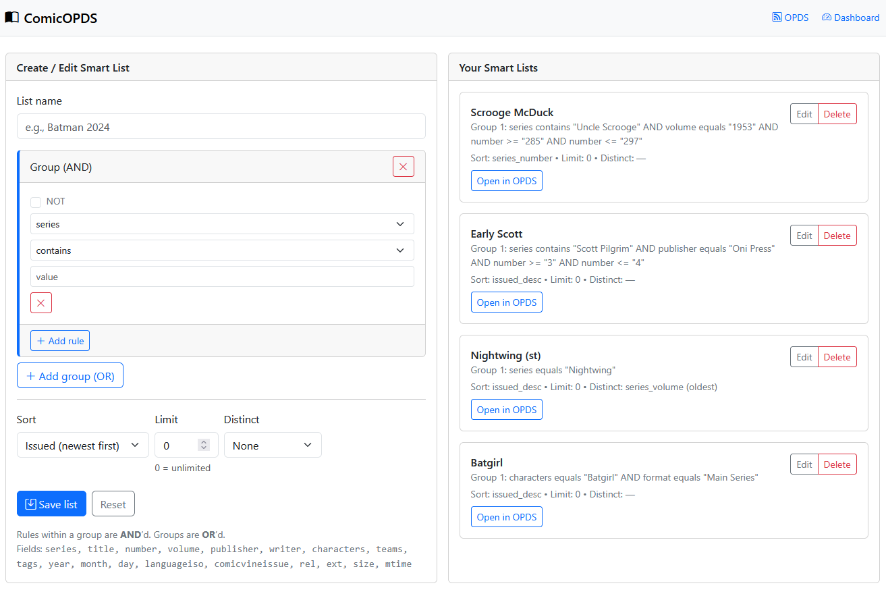

## 🧠 Smart Lists

> Access through `/search`

Smart Lists allow you to create saved search filters that appear as "virtual folders" in your OPDS feed.

### Creating Smart Lists

#### Simple Filters
Add filters using the web interface:
- `series=Batman` 
- `year=2024`
- `publisher=DC Comics`

#### Advanced Filters
Create complex queries with multiple conditions:

```
series contains 'Scrooge McDuck'
volume equals 1953
number >= 285
number <= 297
```

#### JSON Configuration Example
For advanced users, Smart Lists are stored in `/data/smartlist.json`:

```
 {
    "name": "Maul + Vader (1-5)",
    "slug": "maul-vader-1-5",
    "groups": [
      {
        "rules": [
          {
            "not": false,
            "field": "series",
            "op": "contains",
            "value": "Maul"
          },
          {
            "not": false,
            "field": "number",
            "op": "<=",
            "value": "5"
          },
          {
            "not": false,
            "field": "format",
            "op": "equals",
            "value": "Limited Series"
          }
        ]
      },
      {
        "rules": [
          {
            "not": false,
            "field": "series",
            "op": "contains",
            "value": "Vader"
          },
          {
            "not": false,
            "field": "number",
            "op": "<=",
            "value": "5"
          },
          {
            "not": false,
            "field": "format",
            "op": "equals",
            "value": "Main Series"
          }
        ]
      }
    ],
    "sort": "series_number",
    "limit": 0,
    "distinct_by": "",
    "distinct_mode": "oldest"
  }
```

**Maul + Vader (1-5)**:

- Group 1: 
  - series contains "Maul" 
  - number <= 5 
  - format = "Limited Series" 
- Group 2:
  - series contains "Vader" 
  - number <= 5 
  - format = "Main Series"
- Sort: 
  - series_number
  - limit: 0 
  - Distinct: no

### Supported Operations
- `equals`, `contains`, `startswith`, `endswith`
- `=`, `!=`, `>=`, `<=`, `>`, `<` (for numeric fields)
- `not` modifier for any operation

### "Distinct by series and volume (latest)"

When that option is enabled, a smart list will return at most one comic per series and volume.
For each series, it picks the latest issue, using this tie-break:

1. Newer year (cast to integer)
2. If year ties: higher number (cast to integer)
3. If number ties: newer file mtime (last modified time)

So you get a de-duplicated "what's the newest issue for each series?" view.

**Use Cases**:

- A clean "latest per series" shelf (e.g., to see what's new without 300 issues of Batman).
- Weekly pulls / backlog triage: combine with filters like `publisher=Image` or `year >= 2020`.

**Important details / edge cases**

- Numeric casting: blank or non-numeric `year`/`number` are treated as `NULL` → effectively `0`, so those won't beat entries with proper numbers (eg. `16A`). 

**Example use**

- "Latest Image series":
  - Rules: `publisher = "Image Comics"`, `year >= 2018`
  - Distinct by series: on
  
→ One newest issue per Image series since 2018.

### Screenshot

